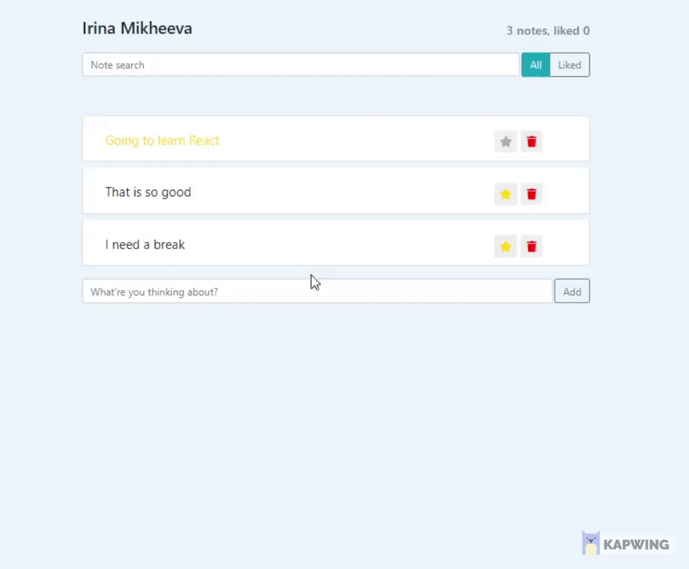

# Twitter Clone on React

#### This project is dedicated to improving my coding skills in React.

##### I wrote it using class syntax instead of functions and hooks. I experimented with different functionalities such as filters on existing notes, adding likes and delete buttons, and munipulating states (on the form and on the note sections). 

### Technologies Used:
     
